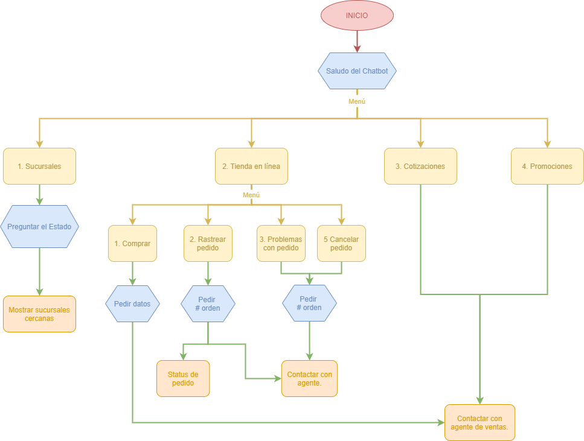
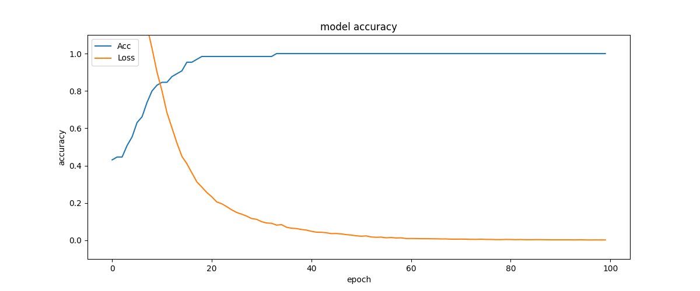

# ChatBot para el cliente Almacenes Anfora
Este proyecto consta de un chatbot para el cliente de Almacenes Anfora. Este fue desarrollado en Python y la base de datos utilizada se encuentra alojada en MongoDB Atlas.

## Diagrama de flujo del chatbot

  

## Gráfica de precisión y pérdida durante el entrenamiento

  

## Instalación de paquetes
Para instalar todos los paquetes requeridos se debe ejecutar el siguiente comando en la terminal:

`pip install -r requirements.txt`

## Ejecutar el chatbot en la terminal
Para ejecutar el chatbot en la terminal se debe correr el siguiente comando:

`python main.py`

## Reentrenar el modelo
En este repositorio se encuentra el archivo "Word2Vect_Spanish.zip" comprimido debido a las restricciones de tamaño de archivos en GitHub, por lo cual para llevar a cabo el entrenamiento de forma satisfactoria se de debe descomprimir este archivo dentro de la misma carpeta del proyecto y así tenerlo como "Word2Vect_Spanish.txt".

`python train.py`
